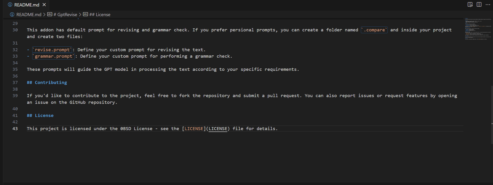

# GptRevise

A Visual Studio Code extension that helps you generate a comparison between the original text and the GPT-revised text.

## Example

## Features

- Revise your text using GPT for better readability, clarity, or style.
- Perform grammar checks on your text.
- Compare the original and revised texts side-by-side.

## Usage

This extension provides two main commands:

1. **Revise Text**: Use GPT to revise your text.
2. **Grammar Check**: Perform a grammar check on your text.

You can access these commands via the Command Palette (`Ctrl+Shift+P` or `Cmd+Shift+P`), and typing either "Revise Text" or "Grammar Check". The default keybindings are `Ctrl+J` and `Ctrl+Shift+J`.

## Extension Settings

Before using the extension, configure the necessary settings:

1. **API URL**: The URL of the GPT API.
2. **API Key**: Your OpenAI API key.
3. **Model**: The GPT model you want to use.

### Additional Setup

This addon has default prompt for revising and grammar check. If you prefer persional prompts, you can create a folder named `.compare` and inside your project and create two files:

- `revise.prompt`: Define your custom prompt for revising the text.
- `grammar.prompt`: Define your custom prompt for performing a grammar check.

These prompts will guide the GPT model in processing the text according to your specific requirements.

Besides, this addon will create a `.compare` folder and two files in it in your project for comparison.

## Contributing

If you'd like to contribute to the project, feel free to fork the repository and submit a pull request. You can also report issues or request features by opening an issue on the GitHub repository.

## License

This project is licensed under the 0BSD License - see the [LICENSE](LICENSE) file for details.